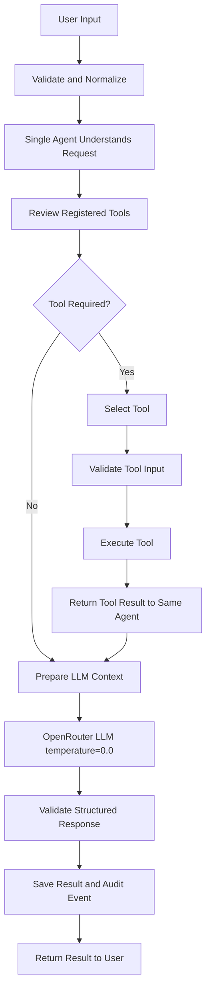

# Single-Agent Tool Workflow

## Goal

Provide one autonomous agent that accepts user input, selects registered tools when useful, sends structured context to OpenRouter, and returns a validated, traceable result.

## Key Success Criteria

- Accept and validate non-empty user input.
- Use exactly one agent controller.
- Select and execute registered tools correctly.
- Return tool results to the same agent.
- Use OpenRouter with `temperature=0.0`.
- Produce structured fields: summary, analysis, recommendation, and confidence.
- Handle unavailable OpenRouter configuration through fallback output.
- Record results and workflow audit events locally.
- Handle unknown tools and tool failures without crashing.

## Workflow



## Tools List and Details

| Tool | Purpose | Input | Output |
|---|---|---|---|
| `extract_terms` | Finds the ten most frequent normalized terms. | `text: string` | `top_terms: list of [term, count]` |
| `count_words` | Counts whitespace-separated words. | `text: string` | `word_count: integer` |
| `detect_question` | Detects whether the input ends with `?`. | `text: string` | `is_question: boolean` |

## Tool Execution Rules

- Tools are registered in `tools.py`.
- The single agent selects tools based on input length and workflow needs.
- Tool outputs are passed back to the same agent.
- Unknown tools return a structured failure result.
- Tool exceptions are captured as warnings.
- Every tool call is included in the final result and audit trail.

## OpenRouter Configuration

Set these variables in `.env`:

```text
OPENROUTER_API_KEY=your_openrouter_api_key_here
OPENROUTER_MODEL=your_model_name
```

Every OpenRouter request uses:

```text
temperature=0.0
```
