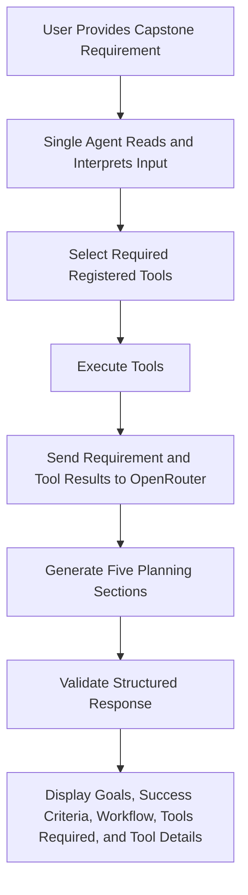

# Single-Agent Capstone Requirement Planner

## Goal

The single agent reads the capstone requirement and produces detailed goals specific to the supplied input.

## Key Success Criteria

The single agent identifies measurable, requirement-specific success criteria from the supplied input.

## Workflow

## Tools Required

The single agent selects tools based on the supplied capstone requirement. Registered baseline tools are `extract_terms`, `count_words`, and `detect_question`; OpenRouter may identify additional requirement-specific tools.

## Tool Details

| Tool | Purpose | Input | Output |
|---|---|---|---|
- `extract_terms`: identifies frequent requirement terms to support tool selection and workflow planning.
- `count_words`: measures input size and supports input processing decisions.
- `detect_question`: identifies whether the input contains a question that must be addressed.
- Requirement-specific tools: identified by the single agent from the user-provided capstone requirement, with each tool's purpose, input, output, and workflow role described in the generated response.

## OpenRouter Configuration

- OpenRouter requests use `temperature=0.5`.
